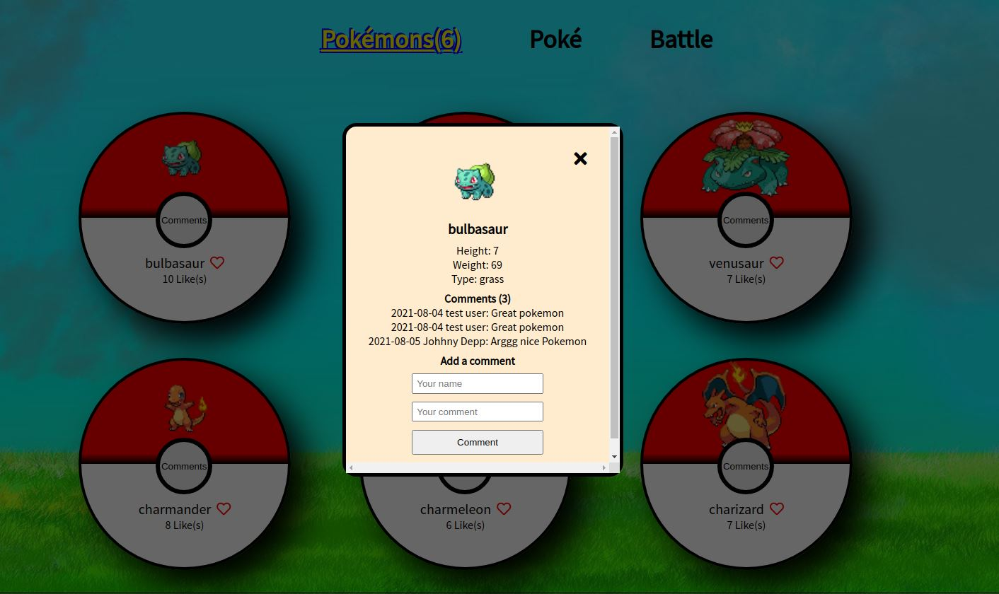

# Pokémon

> A short project for getting data, using Pokemon API.

> 

# Description

> In the project are use Pokeapi API for the data about the Pokémon world and Involvement API to record the different user interactions (likes, comments and reservations) provided from Microverse.
> Six Pokemon are displayed on the board.
> Next to name of pokemon is a like button. So the user can give a like to his favourite pokemon.
> The counter of like is displayed on the board.
> The User can click on the comments button and a popup page will be open. On the card will be displayed a picture of the choosen pokemn, his name, some charachteristics about it (height, weight, type).
> The User can see all the comments, that have been written for this poke and he can also commit, by adding his commit in the "Add a commit" form.

## Built With

- JavaScript
- HTML
- CSS
- Webpack

## Video Demo

[Video Link](https://www.loom.com/share/edadb4d507fd4e9a9b2fa1aa3104731e)

## Live Demo

[Live link](https://tshepo-cloud.github.io/capstone-my-spaceship/).

## Getting Started

To get a local copy up and running follow these simple example steps.

## Instructions

To get a local copy up and running follow these simple example steps.

$ cd <folder>

$ git clone git@github.com:TSHEPO-CLOUD/capstone-my-spaceship.git

### Install

- Set up liveserver as an extension in your VS Code.
- If you dont have the live server extension, or are using another software just view directly in your browser.

### Usage

- npm install axios
- npm install --save-dev jest
- npm run start
- Right click and open the dist/index.html in your browser to view.

## Authors

👤 **Polina Stamenova**

- GitHub: [@githubhandle](https://github.com/PolinaStamenova)
- LinkedIn: [LinkedIn](https://www.linkedin.com/in/polina-stamenova-a60766112/)

👤 **Tshepo David**

- GitHub: [@githubhandle](https://github.com/TSHEPO-CLOUD)
- Twitter: [LinkedIn](https://twitter.com/tshepomolefem)

## 🤝 Contributing

Contributions, issues, and feature requests are welcome!

Feel free to check the [issues page](https://github.com/TSHEPO-CLOUD/capstone-my-spaceship/issues).

## Show your support

Give a ⭐️ if you like this project!

## Acknowledgments

- Microverse
